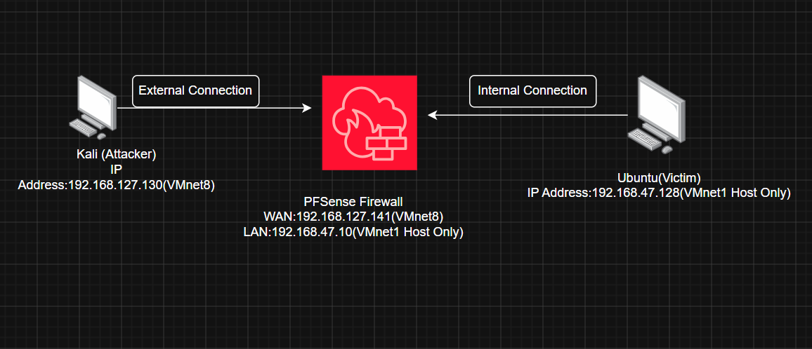
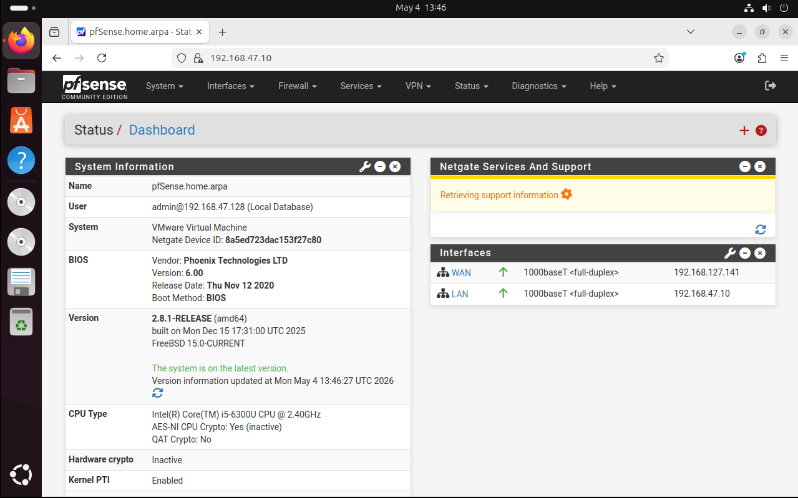
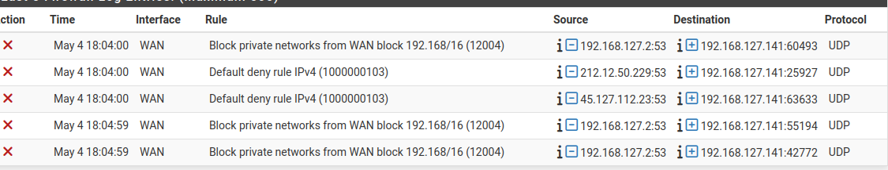

# Network Security Lab - DoS Attack Simulation & pfSense Firewall Protection

---

## Project Overview

This project is a virtual cybersecurity home lab that demonstrates how a **Denial of Service (DoS) attack** is launched, monitored, and blocked using a **pfSense firewall**. The lab was built entirely on VMware Workstation 17 using three virtual machines to simulate a real-world network environment.

The goal was to:
- Simulate a DoS attack from an external attacker machine
- Monitor the attack traffic using Wireshark
- Configure pfSense firewall rules to block the attack
- Verify the block using pfSense firewall logs

---

## 🖥️ Network Topology



```
[Kali - Attacker]                [pfSense Firewall]             [Ubuntu - Victim]
192.168.127.130 (VMnet8) ──WAN──192.168.127.141                192.168.47.128
                                 192.168.47.10  ──LAN────────── (VMnet1 Host Only)
```

---

## 📊 Lab Environment

| Virtual Machine | Operating System | IP Address | Role | VMware Network |
|----------------|-----------------|------------|------|----------------|
| **pfSense** | pfSense CE 2.8.1 | WAN: 192.168.127.141 | Firewall/Router | VMnet8 (WAN) |
| | | LAN: 192.168.47.10 | | VMnet1 (LAN) |
| **Ubuntu** | Ubuntu 22.04 | 192.168.47.128 | Victim (Internal) | VMnet1 Host-Only |
| **Kali Linux** | Kali Linux | 192.168.127.130 | Attacker (External) | VMnet8 NAT |

---

## Tools Used


** VMware Workstation 17 ** 
** pfSense CE 2.8.1**  
** Kali Linux ** 
** Ubuntu 22.04 ** 
** hping3 ** 
** Wireshark**  

---

### 2. pfSense Configuration
- Assigned **WAN** interface to VMnet8 → IP: `192.168.127.141`
- Assigned **LAN** interface to VMnet1 → IP: `192.168.47.10`
- pfSense acts as the gateway between external and internal networks

### 3. Ubuntu Configuration
Set pfSense LAN as default gateway:
```bash
sudo ip route add default via 192.168.47.10
ip route show
```

### 4. Verified Connectivity
Confirmed Ubuntu could be reached through pfSense from Kali:
```bash
ping 192.168.47.128
```

---

## Attack Simulation

### DoS Attack from Kali using hping3


```bash
sudo hping3 -S --flood -V -p 80 192.168.47.128
```

**Command Breakdown:**
| Flag | Meaning |
|------|---------|
| `-S` | Send SYN packets |
| `--flood` | Send packets as fast as possible |
| `-V` | Verbose output |
| `-p 80` | Target port 80 |

---

## 📡 Traffic Monitoring with Wireshark

### During the Attack


Wireshark on Ubuntu showed thousands of TCP packets flooding in per second:
- Source: `192.168.47.1` (pfSense LAN gateway)
- Destination: `192.168.47.128` (Ubuntu)
- Protocol: TCP
- Packets: RST, ACK, SYN flood visible

### After the Attack was Blocked


After pfSense rule was applied:
- TCP Retransmissions visible showing packets not getting through
- DNS queries continued normally
- No new SYN flood packets from attacker

---

## 🛡️ pfSense Firewall Configuration

### pfSense Dashboard


pfSense CE 2.8.1 running on VMware with:
- WAN interface UP → `192.168.127.141`
- LAN interface UP → `192.168.47.10`

### Firewall Rule to Block DoS Attack


| Field | Value |
|-------|-------|
| Action | **Block** |
| Interface | WAN |
| Address Family | IPv4 |
| Protocol | Any |
| Source | 192.168.127.130 (Kali) |
| Destination | 192.168.47.128 (Ubuntu) |
| Logging | Enabled ✅ |

---

## ✅ Results - Attack Blocked

### pfSense Firewall Logs


pfSense logs confirmed all packets from Kali were blocked:
- **Action:** ❌ Block
- **Interface:** WAN
- **Source:** 192.168.127.130 (Kali)
- **Rule:** Block private networks from WAN
- **Protocol:** UDP/TCP

**Before firewall rule:** Ubuntu received thousands of flood packets per second

**After firewall rule:** Zero packets reached Ubuntu from Kali

---

## 📁 Repository Structure

```
Network-Security-Lab/
│
├── README.md
│
├── images/
│   ├── 01-network-topology.png
│   ├── 02-pfsense-dashboard.png
│   ├── 03-firewall-rules_blocked.png
│   ├── 04-dos-attack.png
│   ├── 05-wireshark-capture_during_dos_attack.png
│   ├── 07-attack-blocked.png
│   └── 08-wireshark-capture_after_the_dos_attack.png
│
└── configs/
    └── pfsense-firewall-rules.txt
```

---

## 💡 Key Learnings

1. **Network Segmentation** - Separating internal and external networks using pfSense as a gateway
2. **DoS Attack Mechanics** - How SYN flood attacks overwhelm a victim machine
3. **Firewall Rule Configuration** - Creating rules to block specific source IPs and protocols
4. **Traffic Analysis** - Using Wireshark to monitor and identify attack patterns
5. **Log Analysis** - Reading pfSense firewall logs to verify blocked connections
6. **VMware Networking** - Configuring virtual networks for realistic lab simulations

---

## 🚀 Skills Demonstrated

- ✅ Network Security
- ✅ Firewall Configuration (pfSense)
- ✅ DoS/DDoS Attack Simulation
- ✅ Network Traffic Analysis (Wireshark)
- ✅ Linux Administration (Ubuntu & Kali)
- ✅ VMware Virtualization
- ✅ Network Troubleshooting
- ✅ Security Log Analysis
- ✅ Virtual Network Design
- ✅ Security Documentation

---

## 🔮 Future Improvements

- [ ] Install Suricata IPS for automatic attack detection
- [ ] Add DMZ zone with a web server
- [ ] Configure OpenVPN for remote access
- [ ] Simulate DDoS from multiple IPs
- [ ] Install pfBlockerNG for geo-blocking
- [ ] Add VLAN segmentation

---

## 👤 Author

**Marinus Bakara**
- GitHub: [@Marinus-Bakara](https://github.com/Marinus-Bakara)

---

## ⚠️ Disclaimer

This lab is built for **educational purposes only**. All attacks were performed in a controlled virtual environment. Do not perform these attacks on any real network or system without explicit permission.
